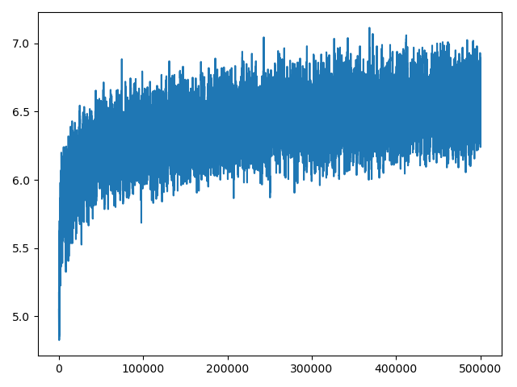

# reinforcement-learning-tictactoe
Table based Q Learning for an agent to learn TicTacToe
It uses an epsilon greedy strategy to find next move. It also decays the initial the epsilon probability after certain number of episodes. \
When running for 100k episodes it achieves a near human level of play.\
After the traning it prints the score progress and lets you play against the AI.
## How to Run
python tictactoe.py [-h]

###Learning Progress
x-axis is episodes,
y-axis is score
